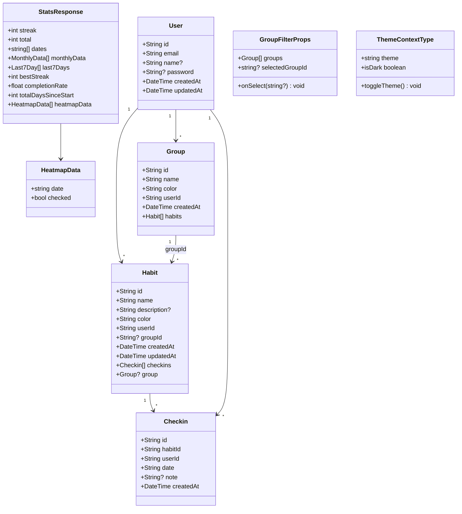
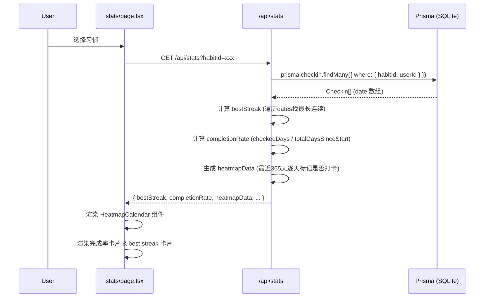
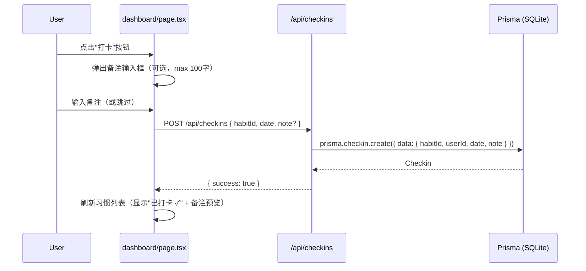
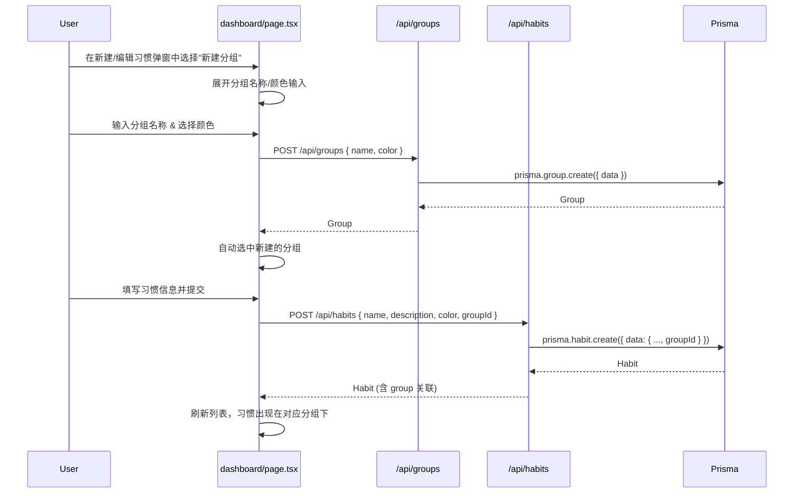
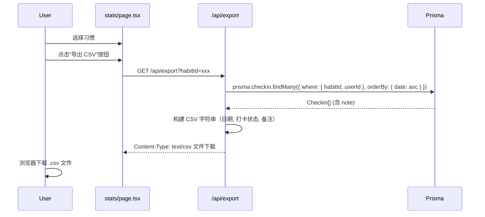
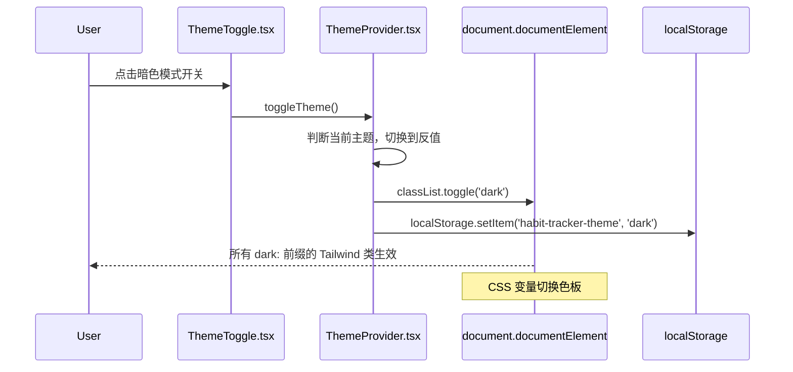
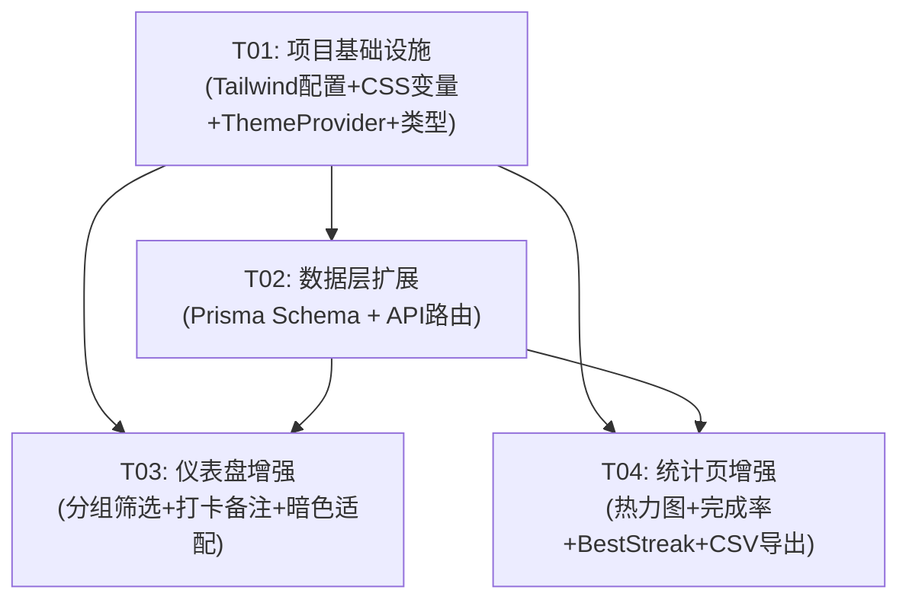

# 习惯打卡应用 — 功能增强架构设计文档

> **版本**: v1.0  
> **作者**: Bob (Architect)  
> **项目**: habit_tracker_enhancement  
> **基础栈**: Next.js 16 + Prisma (SQLite) + NextAuth v4 + Tailwind CSS 3  

---

## Part A: 系统设计

---

### 1. 实现方案 + 框架选型

#### 1.1 总体策略

所有增强功能在现有架构上增量实现，不改变 Next.js App Router / Prisma / NextAuth 的核心技术选型。遵循"最小改动、最大复用"原则。

#### 1.2 每个功能的技术方案

| 功能 | 技术方案 | 理由 |
|------|---------|------|
| **日历热力图** | 纯 CSS Grid 自研组件，无需第三方库 | GitHub 贡献图本质是星期行 × 月份列的网格 + 颜色映射，自研比引入重量级日历库更可控 |
| **完成率统计** | 服务端计算 `checkedDays / totalDaysSinceFirstCheckin × 100%`，通过现有 `/api/stats` 返回 | 计算逻辑简单，无需额外依赖 |
| **最佳连续天数** | 扫描所有打卡日期，计算最长连续序列；通过 `/api/stats` 返回 `bestStreak` 字段 | 与现有 streak 计算共用日期数组，只需增加一次遍历 |
| **习惯分组(标签)** | 新增 `Group` 数据模型（一对多），新增 `/api/groups` CRUD 路由 | 一对一组的模型简单清晰，满足 PRD 建议；分组 CRUD 独立 API 便于未来扩展为独立管理页面 |
| **暗色模式** | Tailwind `darkMode: 'class'` 策略 + CSS 变量 + React Context + localStorage 持久化 + 默认跟随系统 | Tailwind 官方推荐方案，与现有 `globals.css` 无缝集成；Context 避免 props drilling |
| **数据导出 CSV** | 纯字符串拼接生成 CSV，通过 `/api/export?habitId=xxx` 下载 | CSV 格式简单，无需引入 `papaparse` 等库；服务端生成确保数据安全 |
| **打卡备注** | Checkin 模型新增可选 `note` 字段 (String, max 100 chars)，打卡 API 接受可选 `note` 参数 | 单字段扩展，最小化 schema 变更 |

#### 1.3 架构模式

- **前端**: Page Component 模式（当前已是），各组件保持 `'use client'` 
- **状态管理**: 继续使用 React `useState` + `useEffect`，不引入外部状态库（当前规模足够）
- **主题**: Context Provider 模式（`ThemeProvider`）
- **API**: RESTful 路由模式（当前已是）
- **数据库**: 每个模型一个 prisma schema 文件（当前已是）

---

### 2. 文件列表

#### 2.1 新建文件

| # | 文件路径 | 说明 |
|---|---------|------|
| 1 | `src/types/index.ts` | 共享 TypeScript 类型定义 |
| 2 | `src/components/ThemeProvider.tsx` | 暗色模式 Context Provider |
| 3 | `src/components/ThemeToggle.tsx` | 暗色模式切换开关按钮 |
| 4 | `src/components/GroupFilter.tsx` | 分组筛选横向滚动标签栏 |
| 5 | `src/components/HeatmapCalendar.tsx` | 日历热力图组件（GitHub 贡献图风格） |
| 6 | `src/lib/stats-utils.ts` | 统计工具函数（完成率、best streak 计算） |
| 7 | `src/app/api/groups/route.ts` | 分组列表/创建 API |
| 8 | `src/app/api/groups/[id]/route.ts` | 分组修改/删除 API |
| 9 | `src/app/api/export/route.ts` | CSV 导出下载 API |

#### 2.2 修改文件

| # | 文件路径 | 变更内容 |
|---|---------|---------|
| 1 | `prisma/schema.prisma` | 新增 Group 模型，Habit 增加 groupId，Checkin 增加 note |
| 2 | `tailwind.config.js` | 增加 `darkMode: 'class'` |
| 3 | `src/app/globals.css` | 增加 CSS 自定义属性（暗色模式色板） |
| 4 | `src/app/layout.tsx` | 增加 `suppressHydrationWarning`，html 元素增加 class 绑定 |
| 5 | `src/app/providers.tsx` | 包裹 ThemeProvider |
| 6 | `src/app/api/habits/route.ts` | POST 创建时支持 groupId |
| 7 | `src/app/api/habits/[id]/route.ts` | PATCH 修改时支持 groupId |
| 8 | `src/app/api/checkins/route.ts` | POST 打卡支持可选 note 参数；DELETE 不变 |
| 9 | `src/app/api/stats/route.ts` | 增加 bestStreak、completionRate、heatmapData 返回字段 |
| 10 | `src/app/dashboard/page.tsx` | 分组筛选栏、分组折叠、打卡备注输入、暗色模式适配 |
| 11 | `src/app/stats/page.tsx` | 热力图、完成率卡片、best streak 卡片、CSV 导出按钮、暗色模式适配 |
| 12 | `src/app/login/page.tsx` | 暗色模式适配（添加 dark: 前缀类） |
| 13 | `src/app/register/page.tsx` | 暗色模式适配（添加 dark: 前缀类） |

---

### 3. Data Structures & Interfaces



#### 3.1 数据库模型变更

**Group 模型（新建）**:
```prisma
model Group {
  id        String   @id @default(cuid())
  name      String
  color     String   @default("#6B7280")
  userId    String
  user      User     @relation(fields: [userId], references: [id], onDelete: Cascade)
  habits    Habit[]
  createdAt DateTime @default(now())

  @@unique([name, userId])  // 同一用户下分组名唯一
  @@index([userId])
}
```

**Habit 模型（增加 groupId 字段）**:
```prisma
model Habit {
  // ... 现有字段保持不变
  groupId   String?  // 新增：关联的分组 ID
  group     Group?   @relation(fields: [groupId], references: [id], onDelete: SetNull)
  // ...
}
```

**Checkin 模型（增加 note 字段）**:
```prisma
model Checkin {
  // ... 现有字段保持不变
  note      String?  // 新增：打卡备注（最多100字符）
  // ...
}
```

#### 3.2 TypeScript 类型定义 (`src/types/index.ts`)

```typescript
export interface Checkin {
  id: string;
  date: string;       // "YYYY-MM-DD"
  habitId: string;
  note?: string | null;
}

export interface Group {
  id: string;
  name: string;
  color: string;
  userId: string;
}

export interface Habit {
  id: string;
  name: string;
  description: string;
  color: string;
  checkins: Checkin[];
  groupId?: string | null;
  group?: Group | null;
}

export interface StatsResponse {
  streak: number;
  total: number;
  dates: string[];
  monthlyData: { month: string; count: number }[];
  last7Days: { date: string; checked: boolean }[];
  bestStreak: number;
  completionRate: number;
  totalDaysSinceStart: number;
  heatmapData: { date: string; checked: boolean }[];
}

export interface ThemeContextType {
  theme: 'light' | 'dark';
  toggleTheme: () => void;
  isDark: boolean;
}
```

#### 3.3 API 接口设计

| 方法 | 路径 | 请求体 | 返回体 | 说明 |
|------|------|--------|--------|------|
| GET | `/api/groups` | — | `Group[]` | 获取当前用户所有分组 |
| POST | `/api/groups` | `{ name, color }` | `Group` | 创建分组 |
| PATCH | `/api/groups/[id]` | `{ name?, color? }` | `Group` | 更新分组 |
| DELETE | `/api/groups/[id]` | — | `{ success: true }` | 删除分组（关联习惯的 groupId 置 null） |
| POST | `/api/habits` | `{ name, description?, color?, groupId? }` | `Habit` | 创建习惯（增加 groupId 参数） |
| PATCH | `/api/habits/[id]` | `{ name?, description?, color?, groupId? }` | `Habit` | 修改习惯（支持修改分组归属） |
| POST | `/api/checkins` | `{ habitId, date, note? }` | `{ success: true }` | 打卡（增加可选 note 字段） |
| GET | `/api/stats?habitId=xxx` | — | `StatsResponse` | 获取统计（增加 bestStreak, completionRate, heatmapData） |
| GET | `/api/export?habitId=xxx` | — | CSV 文件下载 | 导出指定习惯的打卡记录为 CSV |

---

### 4. 程序调用流程

#### 4.1 热力图数据加载流程



#### 4.2 打卡备注流程



#### 4.3 分组创建 + 习惯关联流程



#### 4.4 CSV 导出流程



#### 4.5 暗色模式切换流程



---

### 5. 待明确事项 & 假设

| # | 事项 | 假设/决策 |
|---|------|----------|
| 1 | 热力图展示范围 | 采用滚动 365 天（非自然年），确保始终有数据 |
| 2 | 分组归属关系 | 一个习惯只能属于一个分组（一对多），设计更简单 |
| 3 | 备注保留期限 | 永久保留，数据量不大 |
| 4 | CSV 导出格式 | 按习惯逐个导出，P2 再支持批量导出 |
| 5 | 暗色模式默认值 | 首次访问跟随系统（`prefers-color-scheme`） |
| 6 | 分组被删除时 | 关联习惯的 groupId 置为 null（`onDelete: SetNull`），习惯不丢失 |
| 7 | 分组名唯一性 | 同一用户下分组名唯一（`@@unique([name, userId])`） |
| 8 | 新建习惯时的分组 | 新建/编辑弹窗增加分组下拉选择器，支持"未分类"选项 |
| 9 | 热力图颜色层级 | 5 级绿色色阶：无打卡 → 低 → 中 → 高 → 很高 |

---

## Part B: 任务分解

---

### 6. 新增依赖包

本项目增强功能**无需新增任何 npm 包**。所有功能使用现有依赖实现：

| 已有依赖 | 用于 |
|---------|------|
| `tailwindcss@^3.4.19` | 暗色模式 (`dark:` 前缀) |
| `date-fns@^4.1.0` | 日期格式化、计算 |
| `recharts@^3.8.1` | 月度柱状图（已有，保持不变） |
| `react` + `react-dom` | 上下文、组件 |

---

### 7. 任务列表

#### T01: 项目基础设施（配置 + 主题系统 + 类型定义）

| 字段 | 内容 |
|------|------|
| **Task ID** | T01 |
| **Task Name** | 项目基础设施：Tailwind 暗色配置 + CSS 变量 + ThemeProvider + 类型定义 |
| **Priority** | P0 |
| **Dependencies** | 无 |
| **Source Files** | 新建：`src/types/index.ts`, `src/components/ThemeProvider.tsx`, `src/components/ThemeToggle.tsx` |
| | 修改：`tailwind.config.js`, `src/app/globals.css`, `src/app/layout.tsx`, `src/app/providers.tsx` |

**变更详情**:

1. **tailwind.config.js** — 增加 `darkMode: 'class'`
2. **src/app/globals.css** — 在 `:root` 和 `.dark` 中定义 CSS 自定义属性（背景色、文字色、卡片色、边框色、输入框色）
3. **src/app/layout.tsx** — html 标签增加 `suppressHydrationWarning`，移除原有固定背景类
4. **src/components/ThemeProvider.tsx** — 新建文件，实现 ThemeContext（`theme`, `toggleTheme`, `isDark`）；初始化时检查 localStorage → 系统偏好 → 默认 light；在 `document.documentElement` 上切换 `dark` class
5. **src/components/ThemeToggle.tsx** — 新建文件，渲染太阳/月亮图标按钮，调用 `toggleTheme()`
6. **src/app/providers.tsx** — 包裹 `<ThemeProvider>`（在 `<SessionProvider>` 内层）
7. **src/types/index.ts** — 新建文件，导出所有共享类型

---

#### T02: 数据层扩展（Prisma Schema + API 路由）

| 字段 | 内容 |
|------|------|
| **Task ID** | T02 |
| **Task Name** | 数据层扩展：Group 模型 + API 路由（groups/habits/checkins/stats） |
| **Priority** | P0 |
| **Dependencies** | T01 |
| **Source Files** | 新建：`src/app/api/groups/route.ts`, `src/app/api/groups/[id]/route.ts` |
| | 修改：`prisma/schema.prisma`, `src/app/api/habits/route.ts`, `src/app/api/habits/[id]/route.ts`, `src/app/api/checkins/route.ts`, `src/app/api/stats/route.ts` |

**变更详情**:

1. **prisma/schema.prisma** 
   - 新增 Group 模型（id, name, color, userId, createdAt, @@unique([name, userId]), @@index([userId])）
   - Habit 模型增加 `groupId String?` + `group Group? @relation(fields: [groupId], references: [id], onDelete: SetNull)`
   - Checkin 模型增加 `note String?`

2. **src/app/api/groups/route.ts** — GET（列表）/ POST（创建，接收 name + color）
3. **src/app/api/groups/[id]/route.ts** — PATCH（更新）/ DELETE（删除，级联置空 habits.groupId）
4. **src/app/api/habits/route.ts** — POST 增加 `groupId` 可选参数
5. **src/app/api/habits/[id]/route.ts** — PATCH 增加 `groupId` 可选参数
6. **src/app/api/checkins/route.ts** — POST 增加可选 `note` 参数（max 100 chars 校验）
7. **src/app/api/stats/route.ts** — 增加 `bestStreak`（遍历 dates 找最长连续）、`completionRate`（checkedDays / totalDaysSinceStart）、`totalDaysSinceStart`、`heatmapData`（365天逐天标记）

---

#### T03: 仪表盘增强（分组筛选 + 打卡备注 + 暗色适配）

| 字段 | 内容 |
|------|------|
| **Task ID** | T03 |
| **Task Name** | 仪表盘增强：分组筛选/折叠 + 打卡备注输入 + 暗色模式适配 |
| **Priority** | P0 |
| **Dependencies** | T01, T02 |
| **Source Files** | 新建：`src/components/GroupFilter.tsx` |
| | 修改：`src/app/dashboard/page.tsx`, `src/app/login/page.tsx`, `src/app/register/page.tsx` |

**变更详情**:

1. **src/components/GroupFilter.tsx** — 新建分组筛选组件：横向滚动标签栏，"全部" + 各分组 + "未分类"；选中高亮；支持折叠状态
2. **src/app/dashboard/page.tsx** — 主要变更：
   - 在习惯列表上方增加 `<GroupFilter>` 组件
   - 按分组折叠展示习惯（手风琴式，可折叠/展开）
   - 打卡时弹出/展开备注输入框（可选，max 100 chars）
   - 已打卡状态下显示备注预览
   - 新建/编辑习惯弹窗增加分组选择器（下拉已有分组 + 输入新建）
   - 全部页面元素添加 `dark:` 前缀 Tailwind 类
3. **src/app/login/page.tsx** — 所有颜色/背景元素添加 `dark:` 前缀类
4. **src/app/register/page.tsx** — 同上

---

#### T04: 统计页增强（热力图 + 完成率 + Best Streak + CSV 导出）

| 字段 | 内容 |
|------|------|
| **Task ID** | T04 |
| **Task Name** | 统计页增强：日历热力图 + 完成率 + Best Streak + CSV 导出 |
| **Priority** | P0 |
| **Dependencies** | T01, T02 |
| **Source Files** | 新建：`src/components/HeatmapCalendar.tsx`, `src/lib/stats-utils.ts`, `src/app/api/export/route.ts` |
| | 修改：`src/app/stats/page.tsx` |

**变更详情**:

1. **src/components/HeatmapCalendar.tsx** — GitHub 风格热力图：
   - CSS Grid 布局（53 列 × 7 行网格）
   - 横轴显示月份标签（1月～12月）
   - 纵轴显示星期几（周一～周日，可选显示间隔）
   - 5 级颜色色阶（从浅绿到深绿）映射打卡频率
   - Tooltip 显示具体日期和打卡状态
   - 接收 `data: { date: string; checked: boolean }[]` 和 `habitColor: string` props

2. **src/lib/stats-utils.ts** — 工具函数：
   - `calculateBestStreak(dates: string[]): number` — 计算历史最佳连续天数
   - `calculateCompletionRate(checkedDays: number, totalDays: number): number` — 计算完成率
   - `generateHeatmapData(dates: string[], days: number): HeatmapData[]` — 生成热力图数据

3. **src/app/api/export/route.ts** — CSV 导出：
   - GET `/api/export?habitId=xxx`
   - 查询指定习惯的所有 checkin（含 note）
   - 构建 CSV：`日期,打卡状态,备注\n2026-01-01,是,今天感觉不错\n...`
   - 返回 `Content-Type: text/csv` 触发浏览器下载
   - 文件名：`习惯名称-打卡记录.csv`

4. **src/app/stats/page.tsx** — 主要变更：
   - 概要卡片区从 2 列变为 3 列：🔥当前连续天数、🏆最佳连续天数、✅完成率
   - 完成率用进度环或进度条展示百分比
   - 新增「日历热力图」区块（条件渲染：选择习惯后显示）
   - 新增「导出 CSV」按钮（仅在选中习惯后显示）
   - 全部元素添加 `dark:` 前缀 Tailwind 类

---

#### T05: （已合并）— 暗色模式已分散在 T01/T03/T04 中实现

> 暗色模式的基础设施在 T01 完成（ThemeProvider + CSS 变量），页面适配在 T03（仪表盘、登录、注册）和 T04（统计页）中各包含。无需独立任务。

---

### 8. 共享知识

#### 8.1 暗色模式约定

| 项目 | 约定 |
|------|------|
| **策略** | Tailwind `darkMode: 'class'`，通过 `<html class="dark">` 控制 |
| **CSS 变量** | 在 `globals.css` 的 `:root`（亮色）和 `.dark`（暗色）中定义 |
| **localStorage key** | `habit-tracker-theme`，值为 `'light'` 或 `'dark'` |
| **默认行为** | 首次访问时检测 `prefers-color-scheme: dark`，跟随系统偏好 |
| **组件使用** | 通过 `useTheme()` hook 获取当前主题和切换函数 |
| **新页面添加** | 任何新页面必须使用 `dark:` 前缀类适配暗色模式 |

#### 8.2 CSS 变量命名规范

```
--bg-primary      主背景色
--bg-secondary    次要背景色（卡片、面板）
--bg-tertiary     三级背景色（输入框、hover 态）
--text-primary    主文字色
--text-secondary  次要文字色
--text-tertiary   三级文字色（占位符）
--border-color    边框色
--accent-blue     强调色（蓝色）
--accent-green    强调色（绿色）
```

#### 8.3 分组相关约定

| 项目 | 约定 |
|------|------|
| **分组名唯一性** | 同一用户下分组名唯一（数据库层 `@@unique([name, userId])`） |
| **分组颜色** | 默认分组颜色 `#6B7280`（灰色），可选预设色板 |
| **"未分类"处理** | `groupId === null` 的习惯视为"未分类"，显示为独立分组标签 |
| **删除分组** | 使用 `onDelete: SetNull`，习惯不丢失，group 字段置 null |
| **分组排序** | 按创建时间升序（`createdAt asc`） |

#### 8.4 数据格式约定

| 项目 | 约定 |
|------|------|
| **日期格式** | 全部使用 `YYYY-MM-DD` 字符串（已是最佳实践） |
| **备注长度** | 最多 100 个字符，前后端均做校验 |
| **API 响应** | 保持现有格式，不改变已有字段 |
| **CSV 编码** | UTF-8 with BOM，确保 Excel 正确打开中文 |
| **CSV 列名** | `日期,打卡状态,备注` |

#### 8.5 热力图颜色色阶

| 级别 | 条件 | 颜色 (亮色) | 颜色 (暗色) |
|------|------|------------|------------|
| 0 | 未打卡 | `#ebedf0` | `#2d333b` |
| 1 | 低频率 | `#9be9a8` | `#0e4429` |
| 2 | 中频率 | `#40c463` | `#006d32` |
| 3 | 高频率 | `#30a14e` | `#26a641` |
| 4 | 很高频率 | `#216e39` | `#39d353` |

---

### 9. 任务依赖图



**依赖说明**:
- **T01 → 所有**: 基础设施是一切的前提（类型定义、主题系统）
- **T02 → T03/T04**: 数据层和 API 完成后，前端才能消费新数据
- **T03 和 T04 可并行开发**（无相互依赖）

---

### 10. 实施建议

1. **推荐实施顺序**: T01 → T02 → T03 + T04（并行）
2. **测试策略**: 每个 API 修改后先用 curl 或浏览器验证；前端组件先用 mock 数据验证
3. **Prisma 迁移**: 执行 `npx prisma migrate dev --name add-groups-and-notes` 自动生成迁移文件
4. **回滚方案**: Git 分支开发，每个任务独立 commit，便于 cherry-pick 回滚
